<p align="center">
  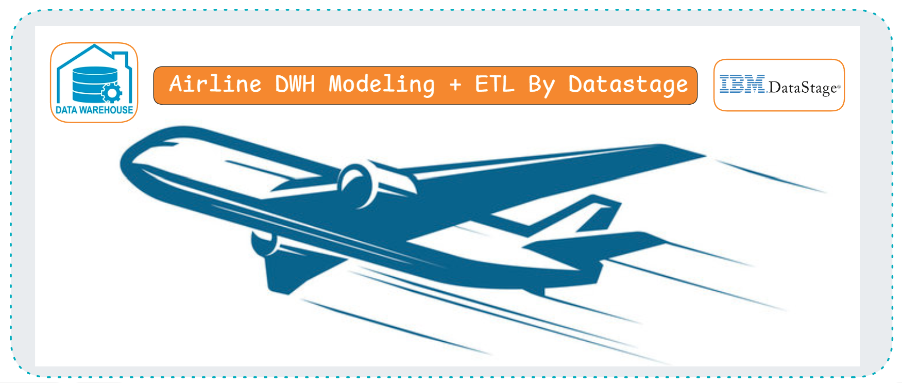
</p>

# Airline DWH Modeling + ETL By Datastage

Dimensional data warehouse design and ETL implementation for an airline analysis simulation, built using Oracle and IBM DataStage.

**Status:** dimensional model fully designed; ETL implemented and demonstrated for a focused subset (4 dimensions + 1 fact table). See [Status](#status) below.

---

## Project Overview

This project simulates a real-world airline data warehouse build, covering:

- Business requirement analysis from a provided case study
- Logical & physical dimensional modeling (star schema)
- Source system profiling (Oracle OLTP tables + CSV feeds)
- ETL pipeline design in IBM DataStage: staging with CDC, dimension loading, and fact table population

---

## Repository Structure

```
/sql/sql_scripts          → All DDL (dimensions, facts, staging tables)
/datastage_jobs/ETL_DWH_Flight_Reservation.dsx   → Exported DataStage jobs
/data                     → Source data files 
/pics                     → Project screenshots & diagrams
```

---

## Business Context

### Data Story

- A passenger books a flight — a **reservation** is born, tied to a **flight**, **route**, and **fare class**.
- The ticket is issued, payment is captured, and a seat is confirmed.
- Some passengers **upgrade** their cabin — with miles, cash, or complimentary.
- Every trip earns or spends **loyalty miles**, shaping the passenger's **frequent flyer tier**.
- Marketing sends **promotions** — some are opened, clicked, and turned into bookings.
- Along the way, passengers may have **overnight layovers**, or reach out with **complaints or feedback**.
- Each flight carries its own **cost** — fuel, crew, maintenance — set against ticket revenue to reveal **profit**.

12 operational tables and 6 event-driven CSVs capture this journey — from booking to boarding to feedback.

Based on a case study for an airline's marketing and finance teams, requiring analysis of:

- Frequent flyer activity, fare classes, and upgrade behavior
- Loyalty miles earned/redeemed
- Promotional response and customer care interactions
- Flight-level profitability

---

## Project Workflow

### 1. Planning

Initial breakdown of business processes, source tables, and target design approach.

<p align="center">
  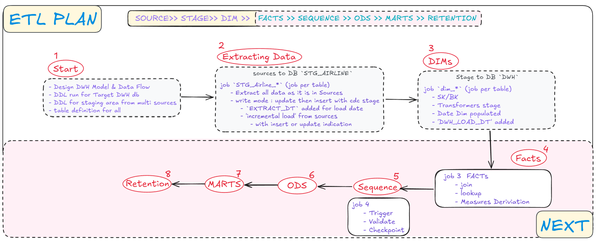
</p>


### 2. Source Data Overview

Review of source structure across Oracle OLTP tables and CSV feeds (promotions, loyalty transactions, customer interactions, upgrades, overnight stays).

OLTP
<p align="center">
  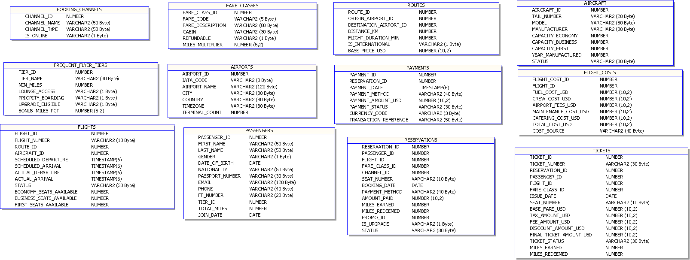
</p>

CSV
<p align="center">
  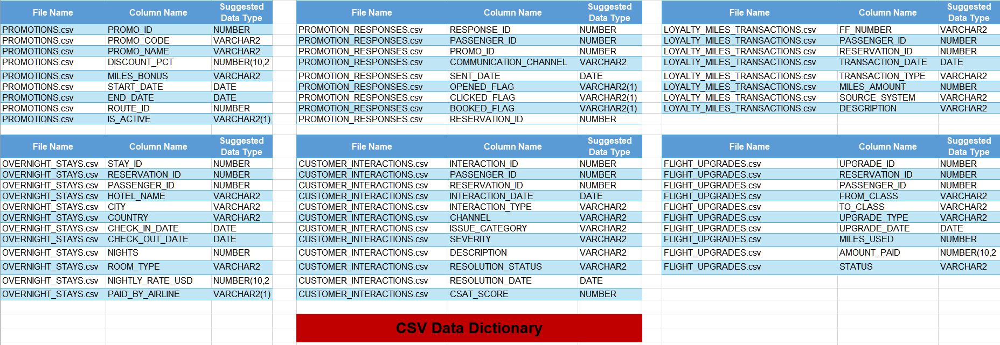
</p>

### 3. Data Warehouse Model

Full star schema , covering all identified business processes (Flight Reservation & Revenue, Loyalty & Marketing, Customer Care). This build focuses on implementing the **Flight Reservation & Revenue** process end-to-end.

<p align="center">
  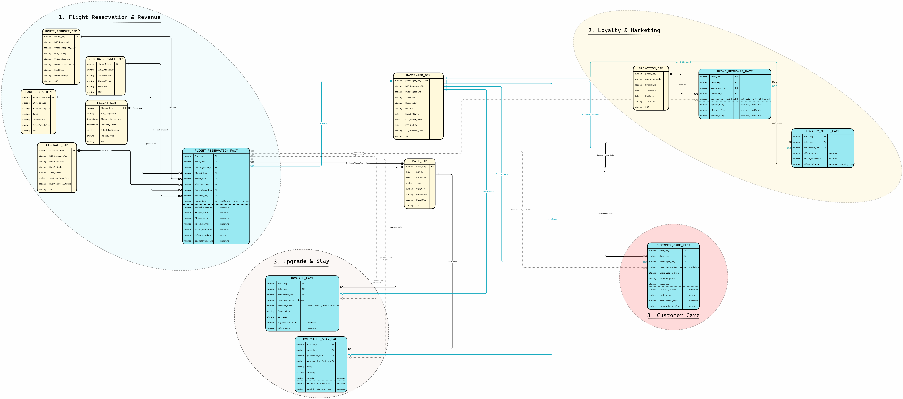
</p>

<p align="center">
  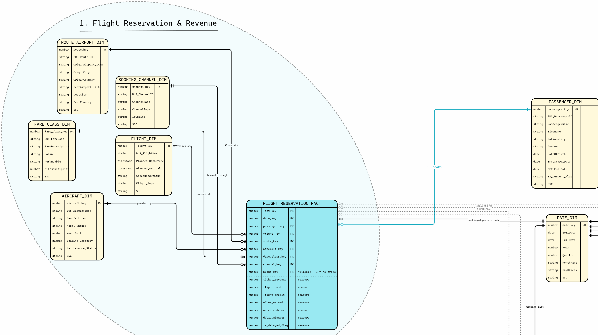
</p>

### 4. Data Marts (Designed)

Two subject-specific data marts were designed on top of the star schema — Revenue & Reservation, and Loyalty & Marketing — as downstream aggregation layers. _Not built in this phase; see [Steps](#Next Steps)._

<p align="center">
  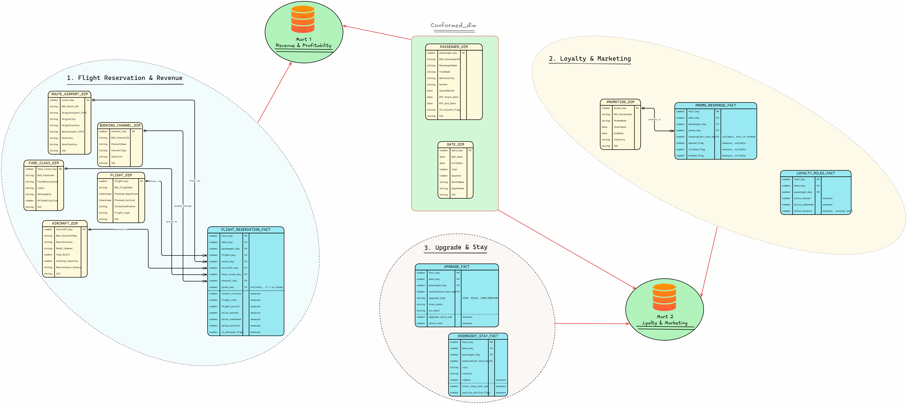
</p>

### 5. Staging Layer — CDC Extraction (CSV + OLTP)

job `STG_Airline_*` (job per table)

Extracting into a separate staging layer isolates cleaning/transformation logic from the live OLTP source, so repeated runs don't hammer production tables. CDC tagging (STG_ACTION, EXTRACTION_DT) solves the problem of telling new rows apart from changed rows without re-pulling the entire source table every run.

- `STG_ACTION` — derived change code (with cdc to incrementally load data) : `1` = new/inserted row, `2` = updated row (code is derived in-flight for tracking; not persisted as a separate write operation)
- `EXTRACTION_DT` — timestamp of the extraction run (can be used when loading to Target Dims)

#### OLAP (schema)

<p align="center">
  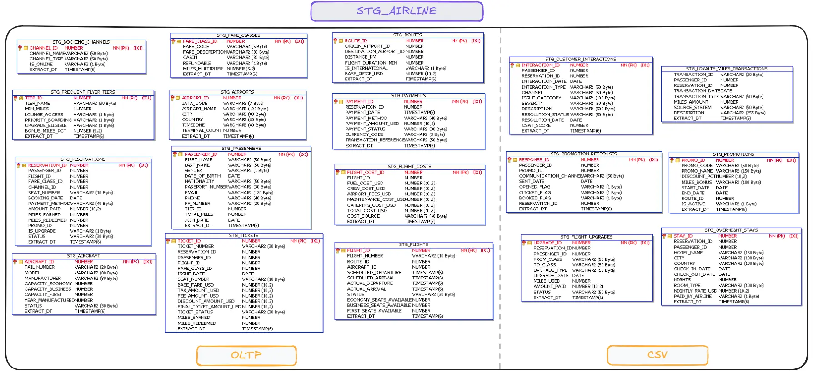
</p>

#### OLTP (load)

job
<p align="center">
  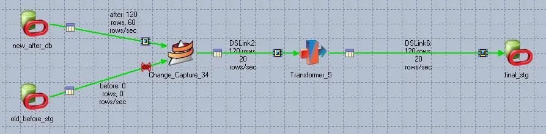
</p>

<p align="center">
  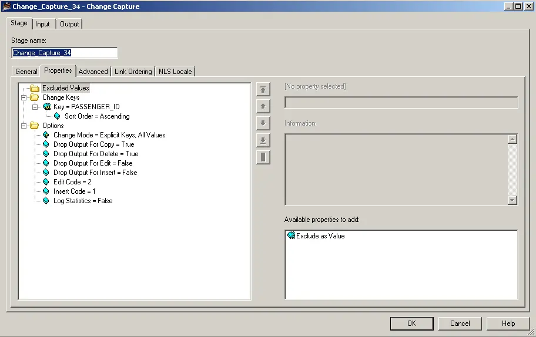
</p>

Transform Stage
<p align="center">
  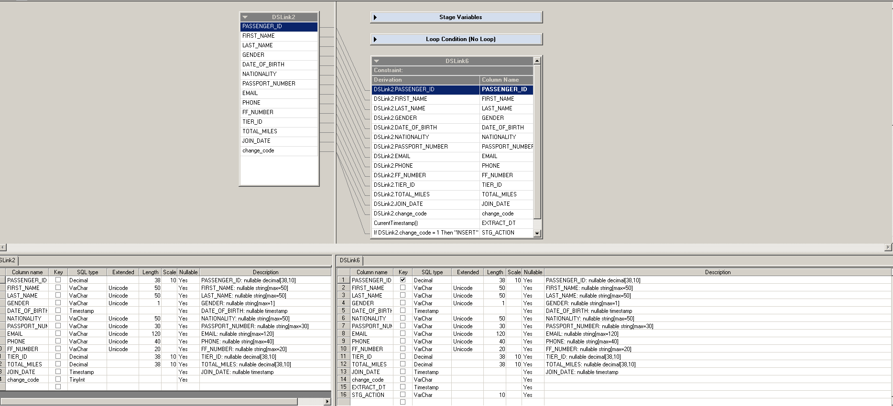
</p>

result
<p align="center">
  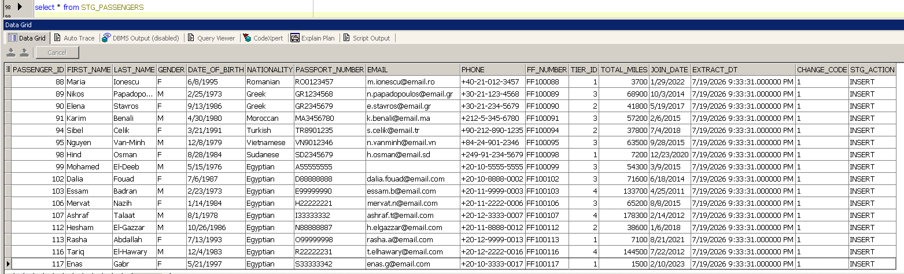
</p>

test update and insert new data
<p align="center">
  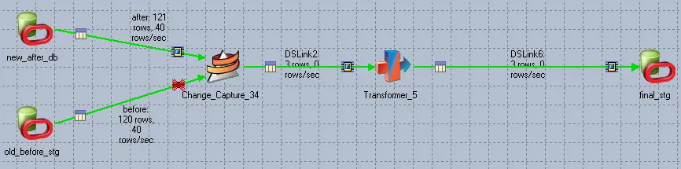
</p>

<p align="center">
  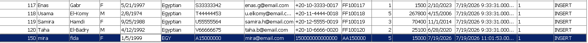
</p>

<p align="center">
  
</p>

#### CSV (load)

job
<p align="center">
  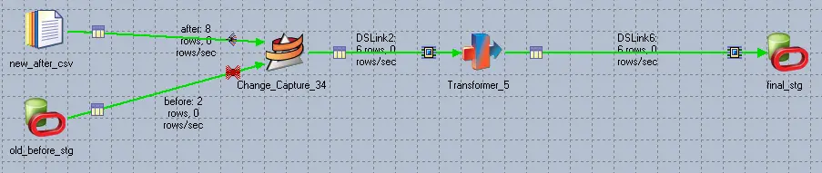
</p>

handle null and date
<p align="center">
  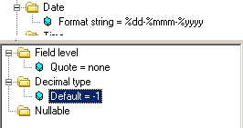
</p>

result
<p align="center">
  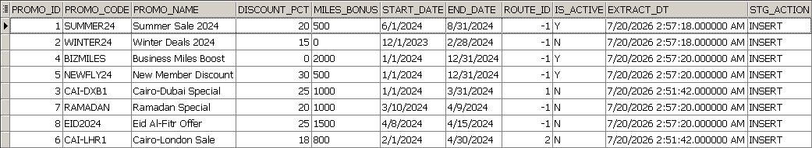
</p>


### 6. Dimension Loading (Surrogate Key Generation)

 job `dim_*` (job per table)   

DataStage jobs load 4 dimensions — **Date, Passenger, Aircraft, Flight** — as **Slowly Changing Dimension Type 1** (lookup + overwrite, no historical tracking). Surrogate keys generated via Oracle sequences and with key generator stage so the fact table stays stable even if source system IDs change format or get reused.

<p align="center">
  
</p>

<p align="center">
  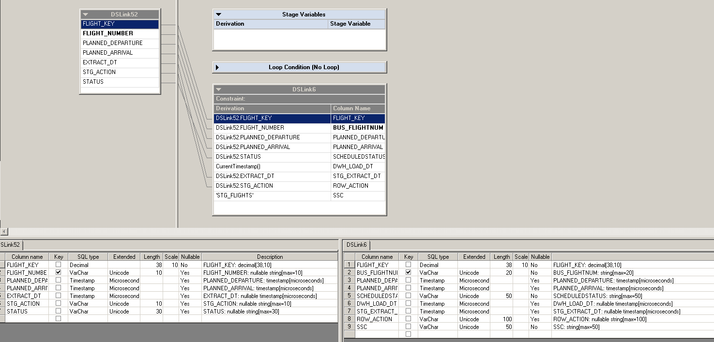
</p>

<p align="center">
  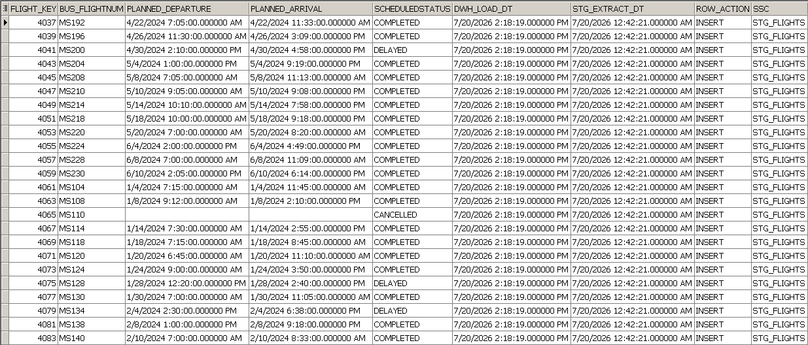
</p>

### 7. Fact Table Load

job `fact_flight_reserve`

`FLIGHT_RESERVATION_FACT` populated via a chain of Lookup stages (Passenger, Aircraft, Flight, Date) resolving surrogate keys, followed by a Transformer stage performing all business calculations (`FLIGHT_PROFIT`, `DELAY_MINUTES`, `IS_DELAYED_FLAG`), then loaded into the target table. `FACT_KEY` is auto-generated via an Oracle sequence at insert.

fact rows only store surrogate keys — resolving those keys via Lookup stages before Transformer calculations ensures every fact row can be correctly traced back to a passenger, flight, aircraft, and date. All business calculations (profit, delay) are centralized in one Transformer stage.

<p align="center">
  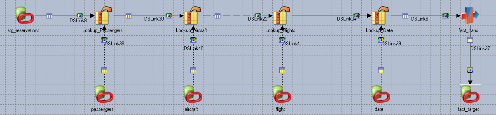
</p>

<p align="center">
  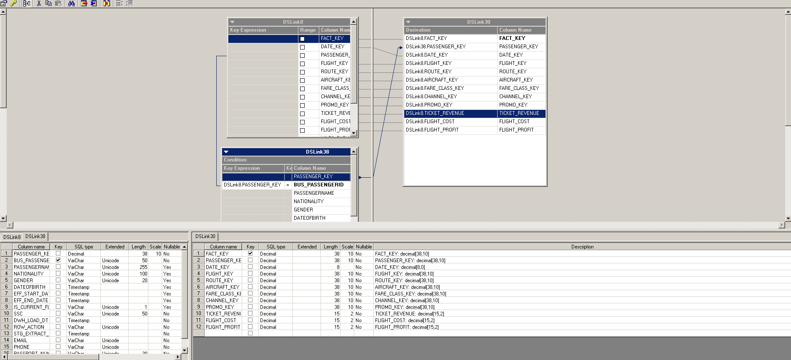
</p>

---

## Status

- **Fully designed:** complete star schema across all 3 business processes, full physical DDL for all dimensions and facts.
- **Fully implemented:** staging (CDC-aware) and dimension load for Date, Passenger, Aircraft, Flight (SCD Type 1).
- **Built, not yet execution-verified:** `FLIGHT_RESERVATION_FACT` load job — pipeline is complete and compiled; full end-to-end run with populated output is the next step.
- **Designed, not implemented:** remaining dimensions (Route, Fare Class, Booking Channel, Promotion), remaining facts (Loyalty Miles, Promo Response, Customer Care, Upgrade, Overnight Stay), data mart materialization, job orchestration/sequencing.

---

## Next Steps

- Complete and verify `FLIGHT_RESERVATION_FACT` load with populated output
- Build remaining dimensions and fact tables per the full star schema
- Implement the two designed data marts as materialized views
- Add job orchestration (DataStage Sequence) with failure recovery
- Apply SCD Type 2 to Passenger dimension for historical tier tracking
- Apply retention Policy and ODS on one of the Dims
